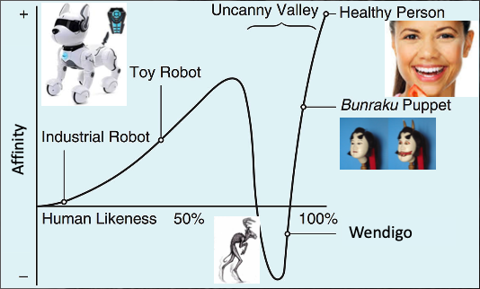

# Mapping-Uncanny-Valley

This is an amazing research project from [Professor Keith](https://www.isi.edu/people/keithab/about)

Here is my code to tackle this.

## Overview
- “Nearly-human” creatures persist in stories across cultures
    - Why are creepy stories filled with almost-human ghosts, zombies, and cryptids?
    - Do popular stories reach a creepy “sweet spot” in which creatures or scenarios are nearly-normal but not quite?
- Goal: help answer what makes text creepy
    - Learn and apply skills of natural language processing
    - Learn what to avoid for AI design and human-computer interaction
    - Understand the psychology of humans: why are creatures or scenarios scary?

## Data 
### [Data](https://tinyurl.com/y5dyh8sw) from subreddits:
- r/NoSleep
- r/Confessions
- r/Confession
- ...

### Metadata:
- 11 GB of data
- 9 Subreddits
- Over 10 years of data
- Mostly English & one small Spanish subreddit
- Comments & Posts (authors, text, score, ...)
- Creepy subreddits:
    - NoSleep, CreepyPasta, Miedo...
- Normal text subreddits:
    - Confessions, confession (two different sites!), TIFU,...

## Weekly Outline
Weekly outline can be seen in the projects tab.
