# Mapping-Uncanny-Valley
This is an amazing research project from [Professor Keith](https://www.isi.edu/people/keithab/about)

Here is my code to tackle this.

## Overview
- “Nearly-human” creatures persist in stories across cultures
    - Why are creepy stories filled with almost-human ghosts, zombies, and cryptids?
    - Do popular stories reach a creepy “sweet spot” in which creatures or scenarios are nearly-normal but not quite?
- Goal: help answer what makes text creepy
    - Learn and apply skills of natural language processing
    - Learn what to avoid for AI design and human-computer interaction
    - Understand the psychology of humans: why are creatures or scenarios scary?

## Data 
### [Data](https://tinyurl.com/y5dyh8sw) from subreddits:
- r/NoSleep
- r/Confessions
- r/Confession
- ...

### Metadata:
- 11 GB of data
- 9 Subreddits
- Over 10 years of data
- Mostly English & one small Spanish subreddit
- Comments & Posts (authors, text, score, ...)
- Creepy subreddits:
    - NoSleep, CreepyPasta, Miedo...
- Normal text subreddits:
    - Confessions, confession (two different sites!), TIFU,...

## Weekly Outline
### Week 1
- Clean the data for spacy similarity check
- Remove stop words each selftext*
- Find the maximum similarity between each text and a certain word
- ’male’, ‘human’, ‘female’, and ‘creepy’ and each text
- Train the data with similarity of each word as features and scores as target
- *Cons: tedious to find all similarities for all tokens in each text*

### Week 2
- Explore how similar a story is to “human”
- Word2vec vs Fasttext
    - Hard to find similarity for out of vocabulary words
- Preprocessing
    - Remove ‘[removed]’, ‘[deleted]’, NAs, and spaces to the left of the string.
    - Sentence lemmatization
        - Remove punctuation and change words to its original form.
- FastText is able to embed OOV words.
- Generated a model with size = 128, window = 12, min_count = 1.
- Testing with an instance in RS_2020_nosleep.csv
- Find the max value of similarity and record the word and its vector as for our similarity between word and text.
- Using these vectors, we can have a rich feature set for future ML
- *Cons: self trained model is limited.*

### Week 4
- Sentence embedding with pretrained model. 
    - Embedding a story using sentence-BERT, a SOTA model to embed text
- Current idea is adding up all vectors to find a story vector and find a linear combination of comments vectors to get the “evaluations” of a story vector.
- Do these steps for r/NoSleep and r/Confessions to make classifications

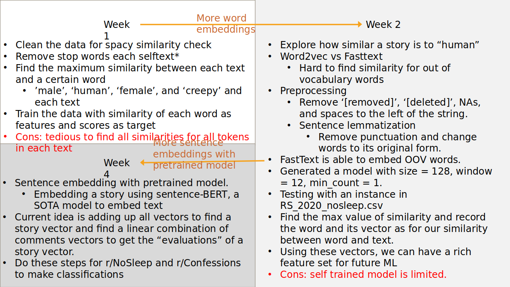

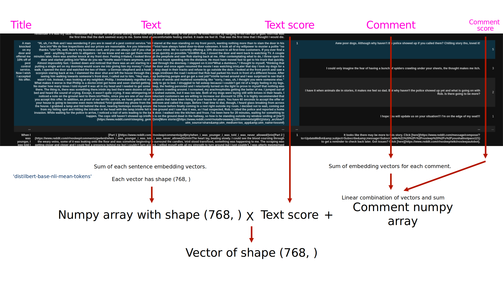

#### Problem
- Order of magnitude: most post has upvotes of 1 or 2. This may lead to instability for neural networks.

### Week 5

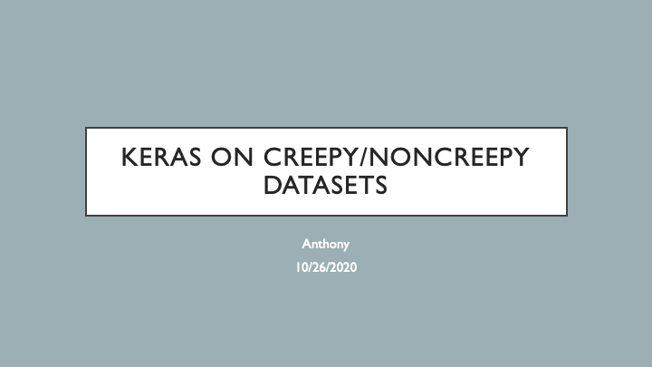

So the data look like this. In particular, I am interested in the data from this column.

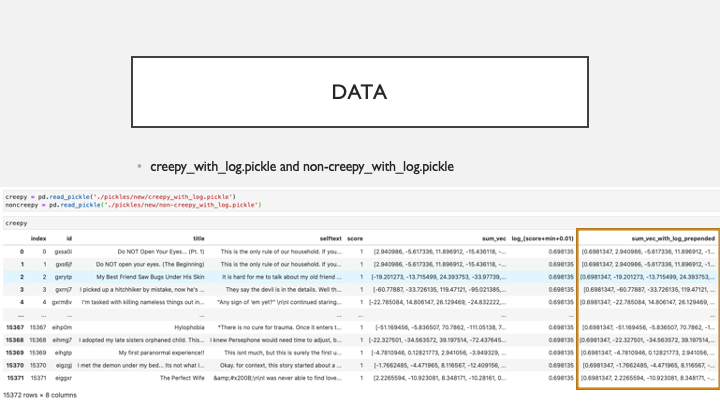

After concatenating creepy and non creepy vectors together, it has around 38,000 instances and each instance has a vector of shape (769,). We can see that after concatenating, the labels of the first half are all ones and of the second half are all zeros, whereas 1 means creepy and 0 means non-creepy.

Then I shuffled the instances and labels correspondingly using the shuffle function from sklearn.

And then, I used the MinMaxScaler funciton from sklearn to map all values in the vectors to small values from 0 to 1.

Finally for the preprocessing step, I used 70% of data for training, 15% for validations, and the rest for testing.

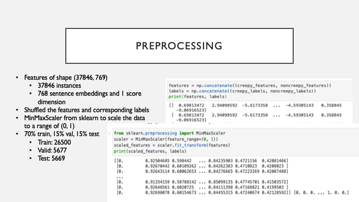

I used model that looks like this. I used 7 hidden layers. Since we are doing binary classification, we would use the 'sigmoid' activation function and we would use the 'binary_crossentropy' loss.

I also changed the optimizer to Adam instead of commonly used stochastic gradient descent. And finally, 30 epochs.

We can see that the accuracies are pretty high across training and validations

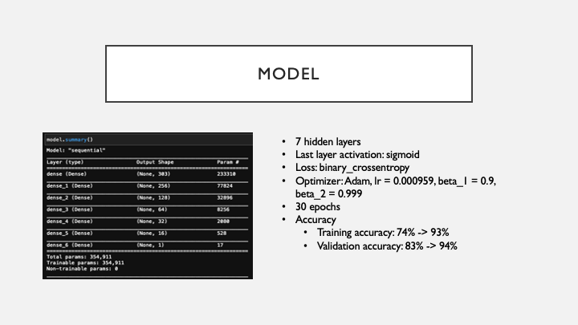

However, after we plot the accuracies and losses into one graph. We can see that accuracy and loss of training are fine, but of validations, the accuracy and loss are fluctuating constantly.

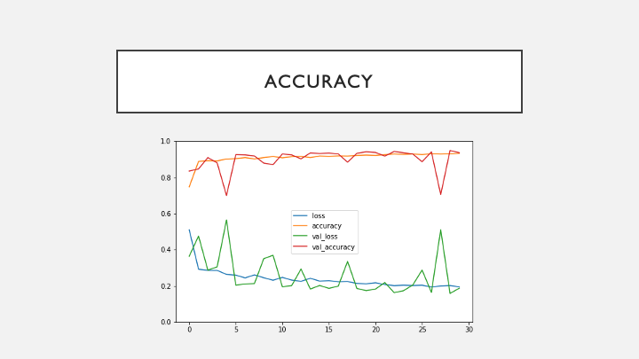

Here are other graphs from tensor board. The light blue and yellow lines were the actual accuracies and losses. If we smooth the lines we can see that validations does follow some patterns of training's accuracies and losses.

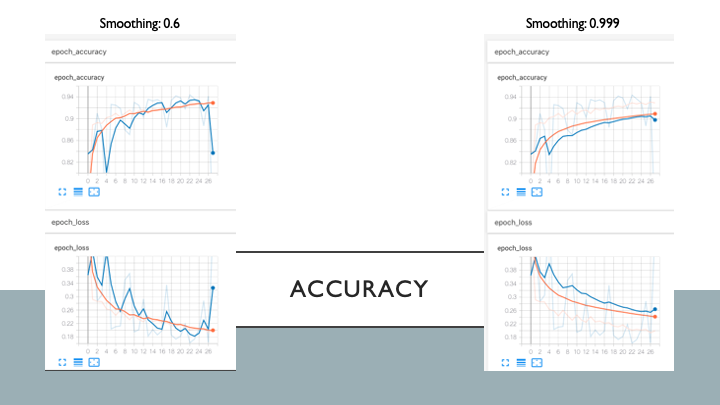

Finally, evaluating on our test data, the result are pretty good, too.

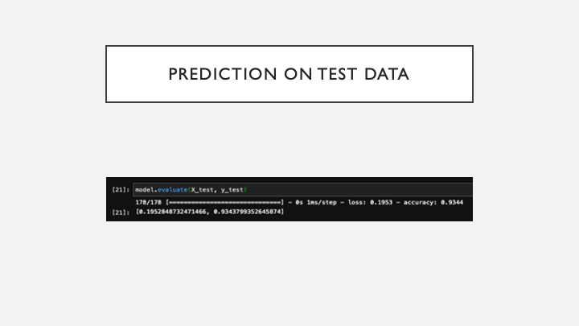

These result are good, but how to find better hyper parameters? I tried hyper parameter tuning using randomized search cv from sklearn. What it does is randmized search on hyper parameters in a loop and find the best hyper parameters after several trails and iterations.

It took a very long time to run even with a GPU, so I finished it after around 5-10 minutes. It gives me learning rate of 0.000959, 2 hidden layers and each layer has 303 neurons.

So I re-run the model as it said, it gives me less accuracy, but less fluctuations too. That is it. I think I will get back to hyperparameter tuning next week for more details.

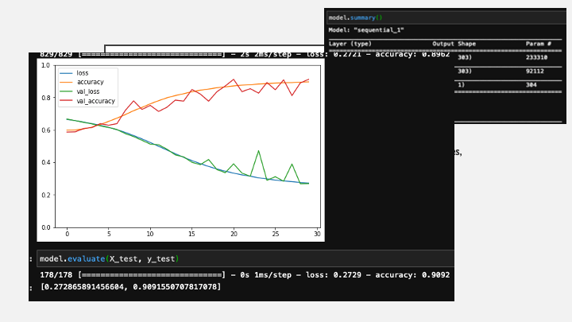

After all that, I randomly selected two stories from reddit to see how this model works. Unfortunately, it gives me completely different predictions.

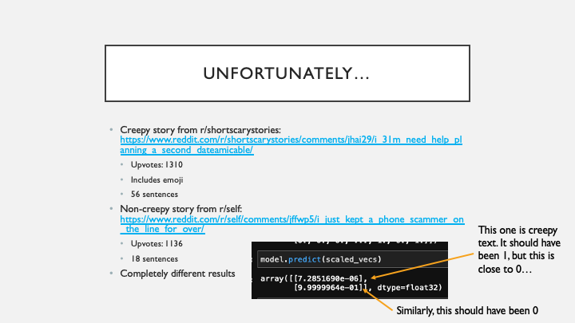

### Week 6

Problems discovered:

- Our data was calculated using sum of sentence vectors. This may add lots of bias towards stories with more sentences.