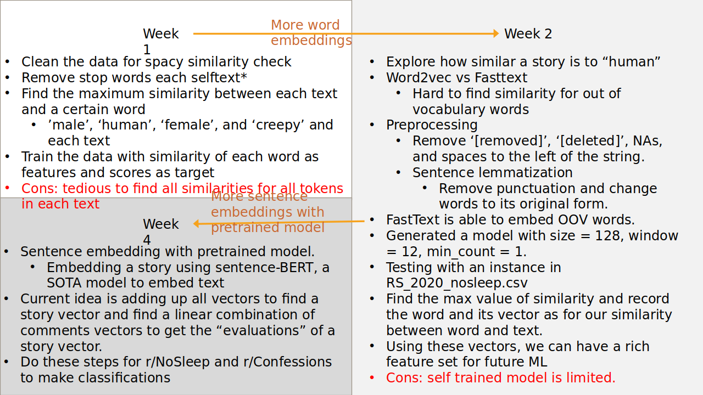

# Mapping-Uncanny-Valley
This is an amazing research project from [Professor Keith](https://www.isi.edu/people/keithab/about)

Here is my code to tackle this.

## Overview
- “Nearly-human” creatures persist in stories across cultures
    - Why are creepy stories filled with almost-human ghosts, zombies, and cryptids?
    - Do popular stories reach a creepy “sweet spot” in which creatures or scenarios are nearly-normal but not quite?
- Goal: help answer what makes text creepy
    - Learn and apply skills of natural language processing
    - Learn what to avoid for AI design and human-computer interaction
    - Understandthepsychologyofhumans:whyare creatures or scenarios scary?
- Skills needed: Python, interest in NLP

## Data 
[Data](https://tinyurl.com/y5dyh8sw) from subreddits:
- r/NoSleep
- r/Confessions
- r/Confession
- ...

Metadata:
- 11 GB of data
- 9 Subreddits
- Over 10 years of data
- Mostly English & one small Spanish subreddit
- Comments & Posts (authors, text, score, ...)
- Creepy subreddits:
    - NoSleep, CreepyPasta, Miedo...
- Normal text subreddits:
    - Confessions, confession (two different sites!), TIFU,...

## Weekly Outline
### Week 1
- Clean the data for spacy similarity check
- Remove stop words each selftext*
- Find the maximum similarity between each text and a certain word
- ’male’, ‘human’, ‘female’, and ‘creepy’ and each text
- Train the data with similarity of each word as features and scores as target
- *Cons: tedious to find all similarities for all tokens in each text*

### Week 2
- Explore how similar a story is to “human”
- Word2vec vs Fasttext
    - Hard to find similarity for out of vocabulary words
- Preprocessing
    - Remove ‘[removed]’, ‘[deleted]’, NAs, and spaces to the left of the string.
    - Sentence lemmatization
        - Remove punctuation and change words to its original form.
- FastText is able to embed OOV words.
- Generated a model with size = 128, window = 12, min_count = 1.
- Testing with an instance in RS_2020_nosleep.csv
- Find the max value of similarity and record the word and its vector as for our similarity between word and text.
- Using these vectors, we can have a rich feature set for future ML
- *Cons: self trained model is limited.*

### Week 4
- Sentence embedding with pretrained model. 
    - Embedding a story using sentence-BERT, a SOTA model to embed text
- Current idea is adding up all vectors to find a story vector and find a linear combination of comments vectors to get the “evaluations” of a story vector.
- Do these steps for r/NoSleep and r/Confessions to make classifications

